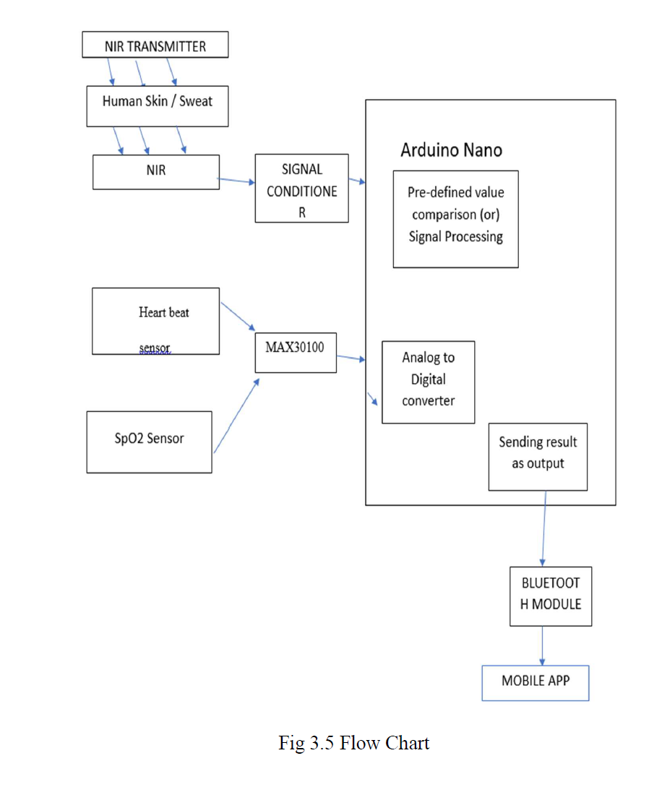
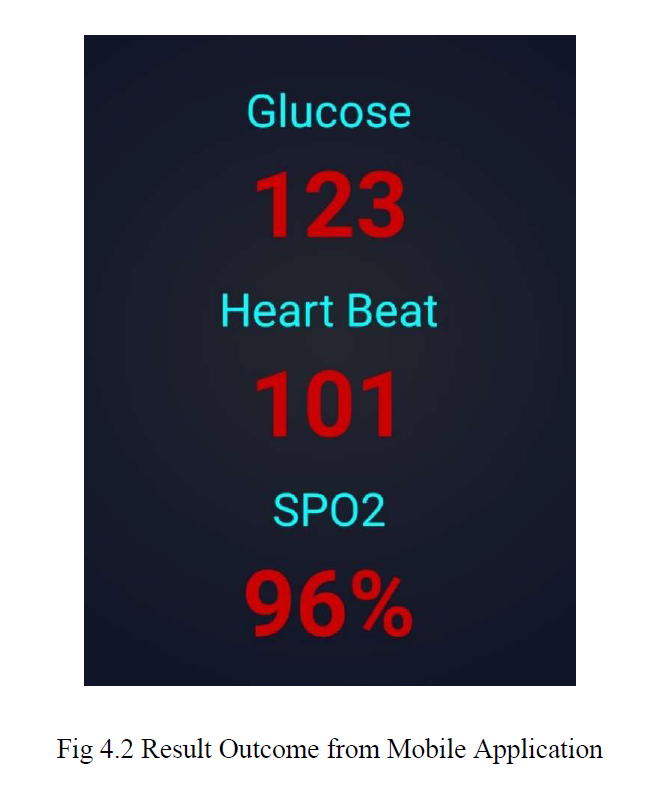

# Smart Health Tracker

An IoT-enabled embedded healthcare system developed to monitor multiple physiological parameters in real time. The system integrates biomedical sensors with an Arduino Nano microcontroller to estimate blood glucose non-invasively, measure heart rate and blood oxygen saturation (SpO₂), and transmit the collected data wirelessly to a mobile application via Bluetooth.


---

## Overview

The Smart Health Tracker was developed as my Bachelor's Final Year Project to demonstrate the integration of embedded systems, biomedical sensors, wireless communication, and mobile applications for real-time health monitoring.

The project combines multiple sensors with an Arduino Nano-based embedded platform, enabling continuous acquisition and transmission of physiological data. A Bluetooth module provides wireless connectivity between the embedded device and a mobile application for live visualization of health parameters.

---

## Features

- Non-invasive blood glucose estimation
- Heart rate monitoring
- Blood oxygen saturation (SpO₂) measurement
- Real-time sensor acquisition
- Bluetooth communication
- Mobile application for live monitoring
- Low-cost embedded healthcare prototype
- Portable and battery-powered design

---

## Hardware Components

- Arduino Nano
- MAX30100 Pulse Oximeter Sensor
- Near Infrared (NIR) Sensor
- HC-05 Bluetooth Module
- LCD Display
- Resistors
- Capacitors
- Power Supply
- Breadboard / Prototype PCB
- Jumper Wires

---

## Software Stack

- Embedded C
- Arduino IDE
- MIT App Inventor
- Bluetooth Serial Communication

---

## Technologies Used

- Embedded Systems
- Embedded C Programming
- Sensor Interfacing
- Biomedical Signal Acquisition
- Bluetooth Communication
- UART Communication
- IoT Prototyping
- Mobile Application Development

---

## System Architecture

The embedded system consists of an Arduino Nano interfaced with biomedical sensors for physiological data acquisition. The acquired sensor data is processed by the microcontroller and transmitted wirelessly using an HC-05 Bluetooth module to a mobile application for real-time visualization.


---

## Hardware Setup

The prototype integrates multiple biomedical sensors with the Arduino Nano through digital and analog interfaces. The complete hardware setup includes the sensing unit, Bluetooth communication module, LCD display, and regulated power supply.


---

## Circuit Diagram

The hardware design connects the Arduino Nano with the biomedical sensors and Bluetooth module to enable reliable physiological data acquisition and wireless communication.


---

## Mobile Application

A mobile application developed using MIT App Inventor receives Bluetooth data from the embedded device and displays real-time physiological measurements.

Features include:

- Live Heart Rate
- Blood Oxygen Saturation (SpO₂)
- Blood Glucose Estimation
- Bluetooth Connectivity


---

## Working Principle

1. Biomedical sensors acquire physiological signals.
2. Arduino Nano processes the sensor data.
3. Embedded algorithms estimate the required health parameters.
4. Processed data is transmitted via the HC-05 Bluetooth module.
5. The mobile application receives and displays the measurements in real time.

---

## Results

The Smart Health Tracker successfully demonstrates:

- Continuous physiological monitoring
- Wireless Bluetooth communication
- Real-time mobile visualization
- Portable embedded healthcare solution


---

## Repository Structure

```
Smart_Health_Tracker
│
├── README.md
├── LICENSE
├── .gitignore
│
├── images/
│   ├── prototype.jpg
│   ├── hardware_setup.jpg
│   ├── system_architecture.png
│   ├── circuit_diagram.png
│   ├── app_interface.png
│   └── results.png
│
├── hardware/
│   ├── Components.md
│   └── Circuit.pdf
│
├── firmware/
│   └── SmartHealthTracker.ino
│
├── app/
│   └── MIT_App_Inventor.aia
│
└── docs/
    └── Smart_Health_Tracker_Report.pdf
```

---

## Future Improvements

- Cloud-based health monitoring
- Wi-Fi connectivity using ESP32
- Secure cloud database integration
- AI-assisted health prediction
- Remote physician dashboard
- Battery optimization
- Miniaturized PCB design

---

## Skills Demonstrated

- Embedded Systems Design
- Embedded C Programming
- Arduino Development
- Biomedical Sensor Interfacing
- Bluetooth Communication
- UART Communication
- IoT System Design
- Mobile App Integration
- Hardware Prototyping
- Real-Time Data Processing


## Mobile Application



---

## Experimental Results

### Blood Glucose Comparison


### Heart Rate Comparison


### SpO₂ Comparison


---

## Author

**Nandhini Bhaskaran**

Master's Student – Electrical Engineering & Embedded Systems

Ravensburg-Weingarten University (RWU)

Germany
